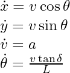
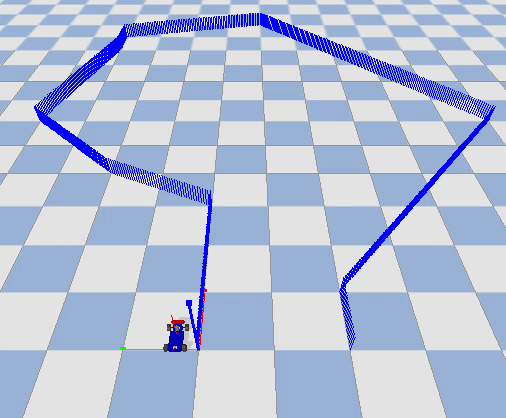
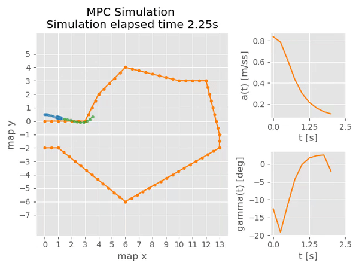

# mpc_python

Python implementation of a mpc controller for path tracking using **[CVXPY](https://www.cvxpy.org/)**.

## About

The MPC is a model predictive path following controller which does follow a predefined reference by solving an optimization problem. The resulting optimization problem is shown in the following equation:


The terns of the cost function are the sum of the **reference tracking error**, **heading effort** and **actuaction rate of change**.

Where R,P,Q are the cost matrices used to tune the response.

The vehicle model is described by the bicycle kinematics model using the state space matrices A and B:



The state variables **(x)** of the model are:

* **x** coordinate of the robot
* **y** coordinate of the robot
* **v** velocuty of the robot
* **theta** heading of the robot

The inputs **(u)** of the model are:

* **a** linear acceleration of the robot
* **delta** steering angle of the robot

## Demo

The MPC implementation is tested using **[bullet](https://pybullet.org/wordpress/)** physics simulator. Racing car model is from: *https://github.com/erwincoumans/pybullet_robots*.


Results:





To run the pybullet demo:

```bash
python3 mpc_demo/mpc_demo_pybullet.py
```

To run the simulation-less demo:

```bash
python3 mpc_demo/mpc_demo_pybullet.py
```

## Requirements

```bash
pip3 install --user --requirement requirements.txt
```

## References
* [mpc paper](https://borrelli.me.berkeley.edu/pdfpub/IV_KinematicMPC_jason.pdf)
* [pythonrobotics](https://github.com/AtsushiSakai/PythonRobotics/)
* [pybullet](https://pybullet.org/wordpress/)
